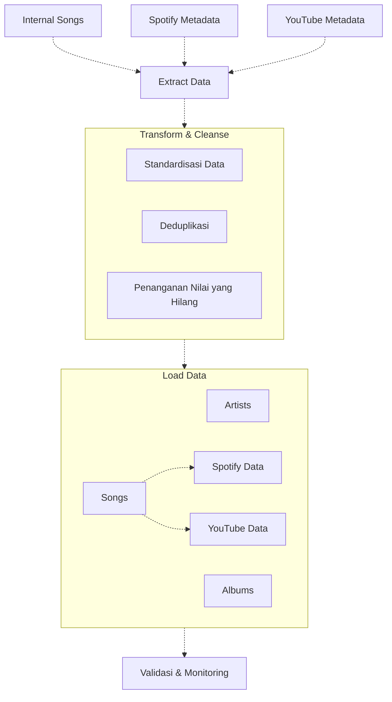

# ETL-dataflow-from-spotify-and-youtube-API

# Data Flow Diagram

## Description

This diagram illustrates the data processing pipeline for music metadata:

1. **Data Sources**:
   - Internal Songs database
   - Spotify Metadata
   - YouTube Metadata

2. **Extract Data**:
   - Collects data from all three sources

3. **Transform & Cleanse**:
   - Standardizes data formats
   - Removes duplicates
   - Handles missing values

4. **Load Data**:
   - Organizes into Artists, Albums, and Songs
   - Songs data further splits into Spotify and YouTube specific data

5. **Validation & Monitoring**:
   - Ensures data quality and system performance
